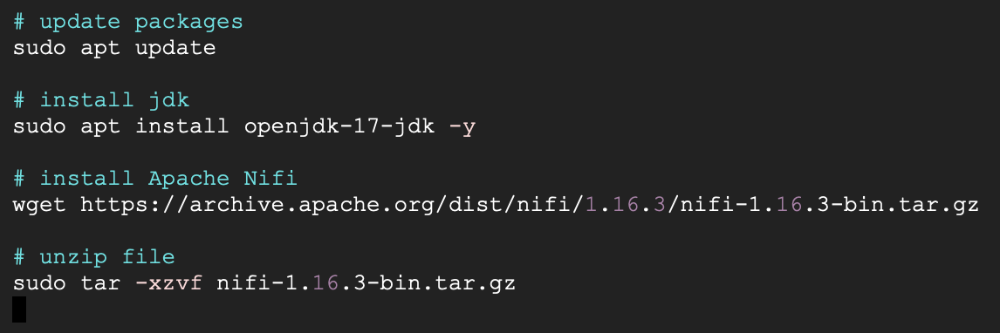
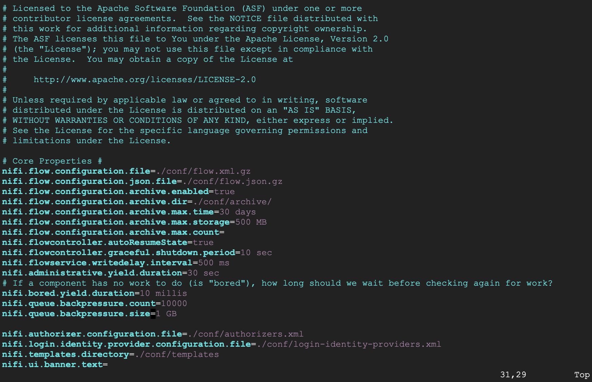
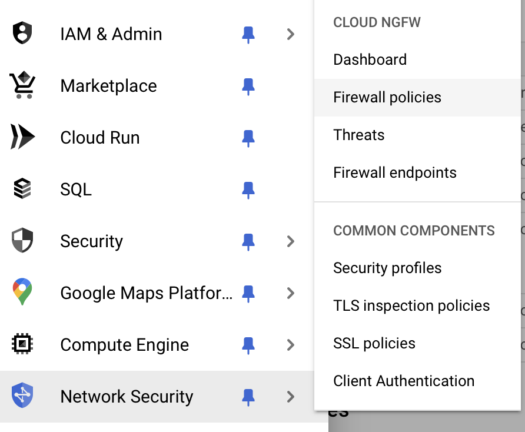
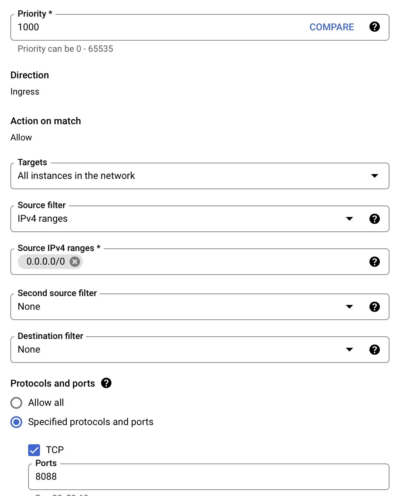
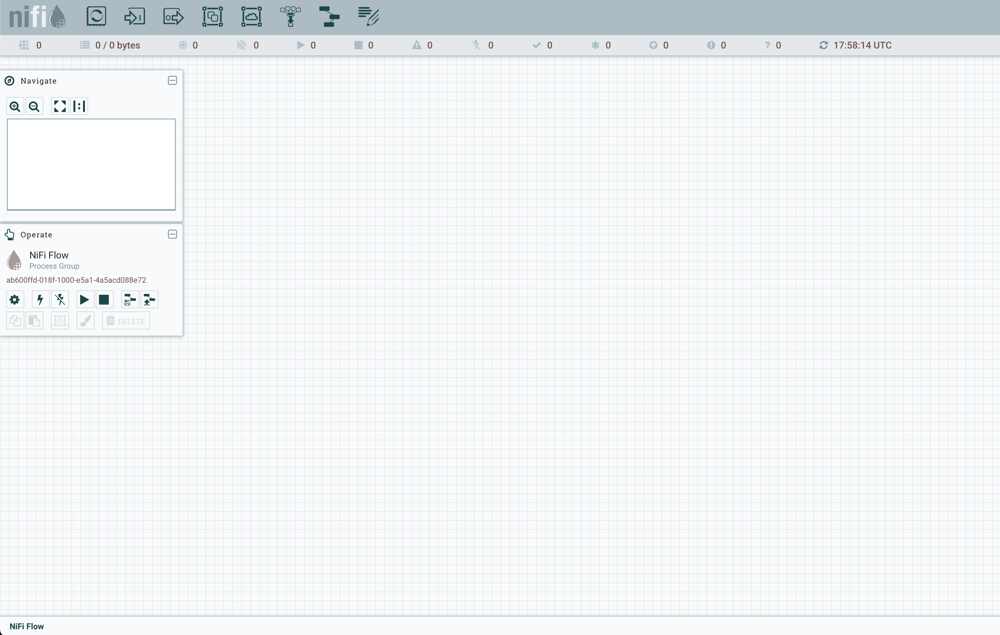

# Install Java run time and Nifi

# nifi.properties configuration
This part is for modify the Nifi configuration to enable access to GCP

open nifi.properties file and modify these following parts

---------------------------------------
`nifi.remote.input.http.enabled = false`

### Web properties
`nifi.web.http.host=`

`nifi.web.http.port=8080`

`nifi.web.https.host=`

`nifi.web.https.port=`

### Security properties

`nifi.security.keystore=`

`nifi.security.keystoreType=`

`nifi.security.keystorePasswd=`

`nifi.security.keyPasswd=`

`nifi.security.truststore=`

`nifi.security.truststoreType=`

`nifi.security.truststorePasswd=`

<!-- Setup firewall for the application -->
## Navigate to Firewall policies

## Configure firewall for application

## Access Nifi through external ip provided by Compute Engine

`http://34.27.62.59:8088/nifi/`

